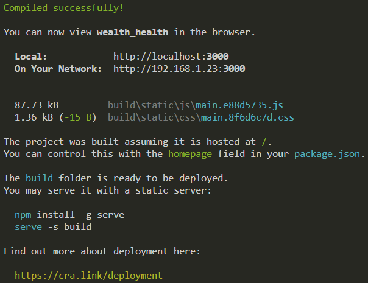

# Khadir_Lounis_Projet_WealthHealth_122022 Style exemple


## 1. General information

You work for the technology department of a major financial company, WealthHealth.

This company uses an internal web application called HRnet, which manages employee files.  
The application is old and uses jQuery side front end, resulting in considerable bugs and  
an increase in internal complaints.
Your development team want to migrate jquery to react application.

## 2. Convert jquery component to react component

I chose to convert the component select, you can find the repository  
and the operating documents on this repository :

[React Component npm package](https://github.com/Squal94/Khadir_Lounis_Projet_14_122022_LibrarySelectv2.git)

## 3.Install packages and library for this application

### Installation

Clone repository

```
git clone https://github.com/Squal94/Khadir_Lounis_Projet_14_122022_styled.git
```

Install packages and library

```
npm i
```

### Dependencies and components

[@squal94/selectcomponent14v7 "^1.0.0"](https://github.com/Squal94/Khadir_Lounis_Projet_14_122022_LibrarySelectv2.git)[react "^18.2.0"](https://github.com/facebook/react/blob/main/CHANGELOG.md#1820-june-14-2022)[react-dom "^18.2.0"](https://github.com/facebook/react)[react-redux "^8.0.5"](https://github.com/reduxjs/react-redux)
[reduxjs/toolkit "^1.9.1"](https://github.com/reduxjs/redux-toolkit)[react-router-dom "^6.4.4"](https://github.com/remix-run/react-router)[react-scripts "5.0.1"](https://github.com/facebook/create-react-app)[sass "^1.56.1"](https://github.com/sass/dart-sass)

This is all the package and library use for the proper operation of this project.

## 4.Start the project

And start the application with the code :

`npm start`

(do not forget in the console to place you in the front folder with command
`cd wealth_health` before launching `npm start`)

And happy navigation.

## 5.Build

Npm run build Succes .



## 6.Classic version

Classic version of Hrnet.

[Classic version](https://github.com/Squal94/Khadir_Lounis_Projet_14_122022.git)

## 7.Something Missing or have an idea ?

You can send me a email to: khadir.lounis@wealth_health.com
